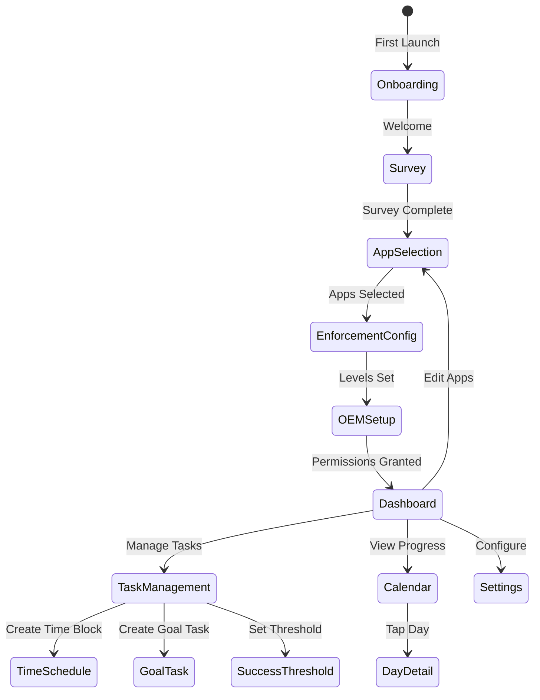
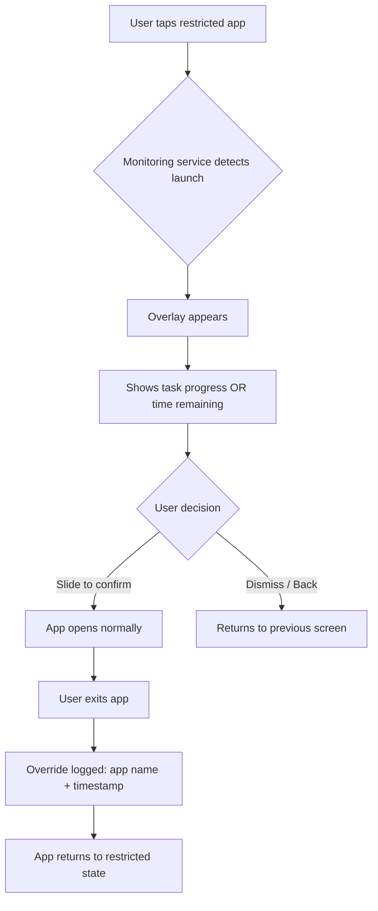
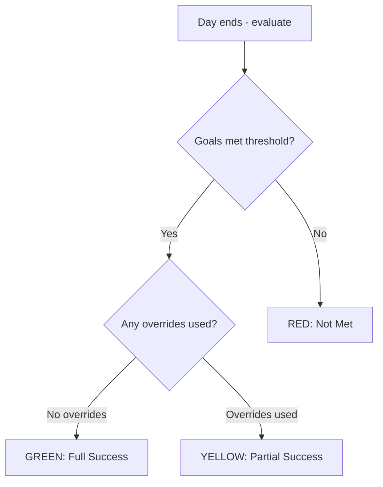

# PRD: Healthy Media

## 0. Metadata

| Attribute | Details |
| :--- | :--- |
| **Author** | Jordan |
| **Status** | Draft |
| **Priority** | P0 |
| **Target Release** | MVP (no fixed date) |
| **Input Document** | `healthy-media-problem-statement.md` |

---

## 1. Problem & Opportunity (The "Why")

### The Problem

People cannot reliably self-regulate their social media usage during periods that demand focus. They reach for social media reflexively — during work, study sessions, or personal projects — losing productive time and entering guilt cycles.

Existing tools fail at this:
- **Too rigid:** Full device lockdowns (e.g., app timers) frustrate users who need occasional access, leading them to disable the tool entirely.
- **Too weak:** Screen-time notifications and usage reminders are easily dismissed and rely entirely on willpower.
- **No task connection:** No existing tool ties social media access to meaningful task completion — the "earn your screen time" model.

### The Evidence

- Personal experience with social media distraction during focused work periods.
- Widespread adoption of screen-time tools (Apple Screen Time, Google Digital Wellbeing, third-party blockers) signals strong market demand for self-regulation.
- Existing tools lack: (a) task-based unlocking, (b) flexible enforcement tiers, (c) habit tracking that rewards progress rather than punishing failure.

### The Opportunity

A tool that bridges the gap between rigid lockdowns and weak reminders. Users set meaningful goals (time-based or task-based), choose their own enforcement severity, and get visual reinforcement of their progress over time. The result: sustainable focus habits built on personal accountability, not brute-force restriction.

---

## 2. Key Decisions & Trade-offs (Alignment)

| Decision | Rationale |
| :--- | :--- |
| **Android first, iOS deferred** | Android provides full access to app-scanning and overlay APIs. iOS restrictions (Screen Time API, MDM profiles) make equivalent functionality impractical for MVP. |
| **Local-only data storage for MVP** | No user accounts, no server, no cloud sync. Simplifies MVP scope and eliminates privacy/compliance concerns. Server-based features deferred to future release. |
| **Users can always override blocks** | The app is a tool, not a cage. Users can slide-to-confirm to bypass any block. This is a deliberate UX decision — overrides are tracked and reflected on the calendar, but never prevented. |
| **Onboarding survey has no functional impact in MVP** | Survey responses (student/work/general) are stored locally for future personalization. No pre-populated defaults or suggestions in MVP. |
| **Multiple time schedules, same app set** | Users can define several non-overlapping time blocks (e.g., work 8am-4pm, study 7pm-9pm). All time blocks apply to the same set of selected blocked apps. Per-schedule app selection is deferred. |
| **User-configurable day reset** | The calendar "day" starts at a user-defined time (e.g., 4am for night owls) rather than fixed midnight. Supports diverse schedules. |
| **Quality over speed** | No fixed deadline. Architecture should support future Play Store release without major rewrites. |

---

## 3. Functional Requirements (The "What")

### FR-001: App Scanning

The system must detect and list all user-installed apps on the device.

**Acceptance Criteria:**

```gherkin
Given the user opens the app selection screen
When the system scans installed apps
Then all user-installed apps are displayed in a scrollable list
And each app shows its name and icon
And system/pre-installed apps may optionally be filtered or flagged
```

---

### FR-002: App Selection

The user must be able to select which apps to apply restrictions to.

**Acceptance Criteria:**

```gherkin
Given the user is on the app selection screen
When the user taps a checkbox next to an app
Then that app is added to the restricted list
And the selection is persisted locally

Given the user has previously selected apps
When the user returns to the app selection screen
Then previously selected apps remain checked
```

---

### FR-003: Enforcement Configuration

The user must be able to set a per-app enforcement level: hard block, soft warning, or no restriction.

**Acceptance Criteria:**

```gherkin
Given the user has selected an app for restriction
When the user configures the enforcement level
Then they can choose between "Hard Block", "Soft Warning", or "Off"
And the selected level is persisted locally
And the enforcement level can be changed at any time

Given the user sets enforcement to "Off" for an app
When the user opens that app
Then no blocking overlay or warning appears
```

---

### FR-004: Blocking Overlay

When a user attempts to open a restricted app, the system must display a blocking overlay with task progress and an intentional bypass mechanism.

**Acceptance Criteria:**

```gherkin
Given the user has active tasks or time-based blocks
And a restricted app has enforcement set to "Hard Block" or "Soft Warning"
When the user attempts to open that app
Then a popup overlay appears showing:
  - Task completion progress (e.g., "3 of 5 tasks done") if goal-based tasks are active
  - Time remaining (e.g., "1h 23m left") if a time-based block is active
And the popup asks "Do you want to allow usage of this app?"
And the confirmation requires a slide-to-confirm gesture (swipe left-to-right)

Given the user completes the slide-to-confirm gesture
When the restricted app opens
Then the app functions normally
And after the user exits that app, the restriction resumes (app returns to blocked state)

Given the enforcement level is "Soft Warning"
When the overlay appears
Then the user is warned but can proceed with reduced friction compared to "Hard Block"
```

---

### FR-005: Time-Based Scheduling

The user must be able to define multiple non-overlapping time blocks during which selected apps are restricted.

**Acceptance Criteria:**

```gherkin
Given the user is creating a time-based schedule
When the user sets a start time and end time
Then a time block is created and persisted locally
And the block applies to all currently selected restricted apps

Given the user creates multiple time blocks
When any two blocks overlap
Then the system prevents the overlap and alerts the user

Given the current time falls within an active time block
When the user attempts to open a restricted app
Then the blocking overlay (FR-004) is triggered
And the overlay shows time remaining until the block ends

Given the current time is outside all active time blocks
When the user opens a restricted app
Then no time-based blocking overlay appears
```

---

### FR-006: Goal-Based Tasks

The user must be able to create named tasks that, when incomplete, restrict access to selected apps.

**Acceptance Criteria:**

```gherkin
Given the user is on the task creation screen
When the user enters a task name (e.g., "Finish coding my app")
Then the task is created with a status of "incomplete" and persisted locally

Given the user has incomplete goal-based tasks
When the user attempts to open a restricted app
Then the blocking overlay (FR-004) is triggered
And the overlay shows task completion progress

Given the user marks a task as complete
When all tasks meeting the success threshold (FR-007) are complete
Then the blocking overlay no longer appears for goal-based restrictions
```

---

### FR-007: Success Threshold Configuration

The user must be able to define how many goal-based tasks must be completed to count as a "successful" day.

**Acceptance Criteria:**

```gherkin
Given the user has created multiple goal-based tasks for a day
When the user configures the success threshold
Then they can set a minimum number of tasks to complete (e.g., "3 of 5")
And the threshold is persisted locally

Given the user has completed tasks equal to or exceeding the threshold
When the system evaluates daily success
Then the day is marked as successful on the calendar

Given the user has completed fewer tasks than the threshold
When the system evaluates daily success
Then the day is marked as not met on the calendar
```

---

### FR-008: Habit Tracking Calendar

The system must display a calendar view showing color-coded daily success status.

**Acceptance Criteria:**

```gherkin
Given the user navigates to the calendar view
When the calendar loads
Then each past day is color-coded:
  - Green (or equivalent): goals met, no blocked app overrides used
  - Yellow/Amber (or equivalent): goals met, but blocked apps were overridden one or more times
  - Red or unmarked: goals were not met
And the current day shows live progress

Given a day had only time-based goals
When the system evaluates that day
Then success is binary: green if the schedule was fully respected, red if it was not
And yellow if the schedule was respected but apps were overridden outside the schedule
```

---

### FR-009: Calendar Day Detail View

The user must be able to tap a day on the calendar to view detailed stats.

**Acceptance Criteria:**

```gherkin
Given the user taps a day on the habit calendar
When the detail view opens
Then it displays:
  - Number of goal-based tasks completed vs. total
  - Number of times blocked apps were overridden (with app names and timestamps)
  - Time-based goal adherence (respected or broken, with schedule details)
  - The success threshold that was configured for that day
  - The resulting color classification (full success / partial success / not met)
```

---

### FR-010: Day Reset Configuration

The user must be able to configure when their "day" starts for calendar tracking purposes.

**Acceptance Criteria:**

```gherkin
Given the user navigates to settings
When the user sets a custom day start time (e.g., 4:00 AM)
Then all calendar day boundaries use that time instead of midnight
And task completion and override tracking align to the custom day boundary

Given the user does not configure a custom day start
When the system evaluates daily progress
Then the default day boundary is midnight (12:00 AM)
```

---

### FR-011: Override Tracking

The system must log every instance of a user bypassing a block, for calendar and stats purposes.

**Acceptance Criteria:**

```gherkin
Given a user completes the slide-to-confirm gesture to override a block
When the restricted app opens
Then the system logs: app name, timestamp, and active task/schedule context
And the log is persisted locally

Given override events exist for a given day
When the calendar evaluates that day's color
Then days with goals met AND overrides used are classified as "partial success"
And override details are visible in the day detail view (FR-009)
```

---

### FR-012: Onboarding Survey

The system must present a brief survey on first launch to capture the user's motivation for using the app.

**Acceptance Criteria:**

```gherkin
Given the user launches the app for the first time
When the onboarding flow begins
Then the user is asked "Why are you using this app?" with options:
  - Student / Studying
  - Work / Professional
  - General screen time reduction
And the response is stored locally
And the survey does not affect app configuration in MVP

Given the user has completed onboarding
When the user launches the app again
Then the survey does not appear again
```

---

### FR-013: OEM Battery Optimization Setup

The system must detect the device manufacturer and guide the user through required battery optimization settings so the background monitoring service runs reliably.

**Acceptance Criteria:**

```gherkin
Given the user launches the app for the first time (or blocking service stops unexpectedly)
When the system detects the device manufacturer
Then manufacturer-specific instructions are displayed (e.g., Xiaomi autostart, Samsung sleep settings, Huawei app launch toggles)
And the user is provided a button to open the relevant system settings screen directly

Given the system periodically checks battery optimization status
When the exemption has been reverted (common on OnePlus, Samsung)
Then the user is gently prompted to re-apply the settings
And the prompt explains why this is needed
```

---

### FR-014: Persistent Background Monitoring

The blocking system must function when the app is not in the foreground.

**Acceptance Criteria:**

```gherkin
Given the user has configured restricted apps and active tasks/schedules
When the user leaves the Healthy Media app
Then the monitoring service continues running in the background
And a persistent notification indicates the service is active

Given a restricted app is launched while the monitoring service is active
When the system detects the app launch
Then the blocking overlay (FR-004) appears before the restricted app is usable

Given the device has been restarted
When the device finishes booting
Then the monitoring service resumes automatically with previously configured settings
```

---

### FR-015: Settings Management

The user must be able to modify all app configurations at any time.

**Acceptance Criteria:**

```gherkin
Given the user navigates to settings
When they view available options
Then they can:
  - Modify app selections (FR-002)
  - Change enforcement levels per app (FR-003)
  - Edit or delete time-based schedules (FR-005)
  - Edit or delete goal-based tasks (FR-006)
  - Adjust success thresholds (FR-007)
  - Change day reset time (FR-010)
  - Disable all blocking entirely (global off switch)
  - Re-run OEM setup wizard (FR-013)

Given the user disables all blocking via the global off switch
When the user opens any previously restricted app
Then no overlay or warning appears
And the calendar reflects that no goals were active for that period
```

---

## Functional Requirements Phases

### MVP (Initial Release)
- FR-001, FR-002, FR-003 (app scanning, selection, enforcement tiers)
- FR-004 (blocking overlay with slide-to-confirm)
- FR-005, FR-006, FR-007 (both task types + success thresholds)
- FR-008, FR-009, FR-010, FR-011 (calendar, day detail, day reset, override tracking)
- FR-012 (onboarding survey — store only)
- FR-013, FR-014 (OEM setup, background monitoring)
- FR-015 (settings management)

### v1.1 (Enhancement)
- Onboarding survey responses drive personalized app/task suggestions
- Recurring task templates
- Per-schedule app selection (different blocked apps per time block)
- Usage analytics and trend reports

### v2.0 (Future)
- Server-based backend (FastAPI) for cloud backup and cross-device sync
- iOS port
- Play Store release with one-time purchase model
- Escalating enforcement mode (warning → hard block after repeated dismissals)
- Social features (accountability partners, leaderboards)

---

## 4. Non-Goals (Out of Scope)

The following are explicitly **not** part of this MVP:

- **User accounts or authentication** — all data is local, no login required.
- **Server-side backend** — FastAPI is planned for future releases but is not part of MVP.
- **Cloud sync or cross-device support** — single device only.
- **iOS support** — Android only for MVP.
- **Play Store listing or in-app purchases** — app runs on the developer's device initially.
- **Social features** — no leaderboards, accountability partners, or shared challenges.
- **Detailed analytics dashboards** — the calendar and day detail view cover tracking needs; advanced analytics are deferred.
- **Automated task detection** — no GPS-based, motion-based, or app-usage-based automatic task completion.
- **Per-schedule app selection** — all time blocks apply to the same set of restricted apps.
- **Onboarding-driven defaults** — survey responses are stored but do not affect app behavior in MVP.

---

## 5. Technical Constraints & Assumptions

### Constraints

- Must run on Android devices (API level TBD in TDD).
- Must be able to detect foreground app launches to trigger the blocking overlay.
- Must be able to display an overlay on top of other apps.
- Background monitoring must survive typical device usage patterns (screen off, app switching, extended background time).
- Must handle OEM-specific battery optimization behaviors that kill background processes (Xiaomi, Samsung, Huawei, OnePlus — see problem statement Section 5a for severity details).
- All user data must remain on-device for MVP. No network calls for core functionality.
- Expo Go is limited to UI development. Native features (app scanning, overlay, background service) require development builds.

### Assumptions

- Users are willing to grant required system permissions (usage access, overlay, battery optimization exemption) when guided through the process.
- A persistent notification (required for background service) is acceptable to users given the app's purpose.
- The slide-to-confirm gesture provides sufficient friction to prevent accidental overrides while remaining accessible.
- Users will re-apply OEM battery settings when prompted after system resets.

---

## 6. Design & Visuals

### Primary UI States



### Blocking Overlay Flow



### Calendar Color Logic



### Key Screens (Wireframes TBD)

1. **Onboarding Survey** — single question, three options, clean full-screen layout
2. **App Selection** — scrollable list with checkboxes, search/filter, app icons
3. **Enforcement Config** — per-app toggle/selector for Hard Block / Soft Warning / Off
4. **Task Management** — list of active tasks (time-based and goal-based), create/edit/delete
5. **Success Threshold** — simple numeric selector ("Complete at least X of Y tasks")
6. **Blocking Overlay** — popup over restricted app with progress info and slide-to-confirm bar
7. **Dashboard** — summary of today's status, quick access to tasks, calendar, and settings
8. **Calendar** — month view with color-coded days
9. **Day Detail** — stats breakdown for a selected day
10. **Settings** — all configurable options including day reset time, global off switch, OEM re-setup
11. **OEM Setup Wizard** — manufacturer-detected instructions with "Open Settings" button
