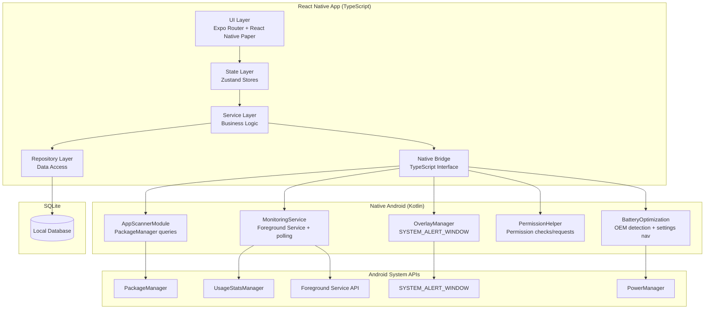

# TDD: Healthy Media

## 0. Metadata

| Attribute | Details |
| :--- | :--- |
| **PRD** | `docs/prd-healthy-media.md` |
| **Problem Statement** | `healthy-media-problem-statement.md` |
| **Status** | Draft |
| **Tech Lead** | Jordan |
| **Standards** | `process/standards/global/coding-style.md`, `process/standards/global/error-handling.md`, `process/standards/global/conventions.md`, `process/standards/testing/test-writing.md` |

---

## 1. Technology Choices

| Category | Choice | Rationale | Alternatives Considered |
| :--- | :--- | :--- | :--- |
| Language | TypeScript | Type safety for complex state (blocking rules, schedules, calendar logic). Per coding standards. | JavaScript (no type safety) |
| Framework | React Native + Expo (managed w/ dev-client) | Cross-platform foundation with native module support via dev-client. Expo Go for UI-only dev. | Bare React Native (more setup, less tooling), Flutter (different language/ecosystem) |
| Navigation | Expo Router | File-based routing, standard for Expo projects, deep linking support. | React Navigation (manual route config, more boilerplate) |
| UI Library | React Native Paper | Material Design components, strong Android fit, good accessibility, active maintenance. | Tamagui (steeper learning curve), Custom (more work, no component library) |
| State Management | Zustand | Lightweight, no boilerplate, TypeScript-native, works well with React Native. Sufficient for local-only app state. | Redux (heavy boilerplate for this scope), React Context (performance issues with frequent updates), Jotai (atomic model less intuitive for this domain) |
| Database | SQLite via `expo-sqlite` | Local-only persistence, no server dependency, well-supported in Expo ecosystem. | AsyncStorage (not suited for relational queries), WatermelonDB (overkill for MVP), MMKV (key-value only) |
| Native Modules | Custom Kotlin via Expo config plugin | No maintained third-party library exists for app blocking. Custom module gives full control over UsageStatsManager, SYSTEM_ALERT_WINDOW, and foreground service. | react-native-app-usage (read-only, no blocking), Bare workflow eject (loses Expo tooling benefits) |
| Background Service | `react-native-background-actions` + custom Kotlin service | Persistent foreground service required for continuous monitoring. Library handles notification; custom Kotlin handles polling logic. | expo-background-fetch (15-min minimum interval, unsuitable), expo-task-manager (not designed for continuous monitoring) |
| OEM Detection | `expo-device` + `@notifee/react-native` | expo-device for manufacturer string. Notifee provides OEM-specific power manager intent database and settings navigation. | Manual intent mapping only (fragile, requires constant maintenance) |
| Testing | Jest + React Native Testing Library | Ships with Expo, deep React Native integration. RNTL for component testing. | Vitest (per standards, but poor React Native support), Detox (E2E only, heavy setup) |
| Linting | ESLint + Prettier | Per coding standards. Enforce on save and in CI. | Biome (less ecosystem support for RN) |
| Build | EAS Build | Standard Expo build service. Required for dev-client builds with native modules. | Local builds (complex Android SDK setup) |
| Package Manager | npm | Default for Expo projects. Consistent with ecosystem. | yarn (no significant advantage here), pnpm (Expo compatibility concerns) |

---

## 2. Architecture Overview

### Components



### Boundaries

| Boundary | Communication | Sync/Async |
| :--- | :--- | :--- |
| UI → Stores | Direct function calls (Zustand hooks) | Sync |
| Stores → Services | Async function calls | Async |
| Services → Repositories | Async function calls (SQLite queries) | Async |
| Services → Native Bridge | React Native NativeModules + NativeEventEmitter | Async |
| Native Bridge → Kotlin Modules | React Native bridge (JSON serialization) | Async |
| MonitoringService → JS | NativeEventEmitter events | Async |
| MonitoringService → OverlayManager | Direct Kotlin function calls (same process) | Sync |

### Representative Data Flow: User Opens Blocked App

1. **MonitoringService** (Kotlin) polls `UsageStatsManager` every ~500ms
2. Detects foreground app change to a blocked package name
3. **MonitoringService** calls **OverlayManager** to display blocking overlay natively
4. Overlay shows task progress (fetched from JS via bridge) and slide-to-confirm
5. If user slides to confirm: **OverlayManager** dismisses overlay, **MonitoringService** emits `onOverrideConfirmed` event to JS
6. JS **blocking-service** receives event, calls **override-event-repository** to log the override
7. **calendar-store** updates today's override count

### Representative Data Flow: User Completes a Task

1. User taps "complete" on a goal task in the UI
2. **task-store** calls **task-service.completeTask(taskId)**
3. **task-service** updates task in **goal-task-repository** (SQLite)
4. **task-service** checks success threshold via **daily-record-service**
5. If threshold met: **blocking-service.evaluateBlockingState()** is called
6. If all blocking conditions resolved: **native bridge** signals **MonitoringService** to stop blocking for the current cycle
7. **calendar-store** updates today's progress

---

## 3. Data Models

### BlockedApp

```
BlockedApp
  id: TEXT PRIMARY KEY — UUID v4
  package_name: TEXT NOT NULL — Android package name (e.g., "com.instagram.android")
  app_name: TEXT NOT NULL — Display name
  icon_uri: TEXT — Local URI to cached app icon
  enforcement_level: TEXT NOT NULL — 'hard_block' | 'soft_warning' | 'off'
  created_at: TEXT NOT NULL — ISO 8601
  updated_at: TEXT NOT NULL — ISO 8601

  Constraints: UNIQUE(package_name)
  Indexes: idx_blocked_app_enforcement ON (enforcement_level)
```

### TimeSchedule

```
TimeSchedule
  id: TEXT PRIMARY KEY — UUID v4
  name: TEXT NOT NULL — User-defined label (e.g., "Work Hours")
  start_time: TEXT NOT NULL — HH:MM format (24h)
  end_time: TEXT NOT NULL — HH:MM format (24h)
  days_of_week: TEXT NOT NULL — JSON array of integers 0-6 (0=Sunday)
  is_active: INTEGER NOT NULL DEFAULT 1 — 0 or 1
  created_at: TEXT NOT NULL — ISO 8601
  updated_at: TEXT NOT NULL — ISO 8601

  Constraints: start_time < end_time (enforced at application layer for simplicity)
  Indexes: idx_time_schedule_active ON (is_active)
```

### GoalTask

```
GoalTask
  id: TEXT PRIMARY KEY — UUID v4
  name: TEXT NOT NULL — Task description (e.g., "Finish coding my app")
  date: TEXT NOT NULL — YYYY-MM-DD (aligned to user's day reset time)
  is_completed: INTEGER NOT NULL DEFAULT 0 — 0 or 1
  completed_at: TEXT — ISO 8601, null if not completed
  created_at: TEXT NOT NULL — ISO 8601
  updated_at: TEXT NOT NULL — ISO 8601

  Indexes: idx_goal_task_date ON (date), idx_goal_task_date_completed ON (date, is_completed)
```

### SuccessThreshold

```
SuccessThreshold
  id: TEXT PRIMARY KEY — UUID v4
  date: TEXT NOT NULL UNIQUE — YYYY-MM-DD
  required_count: INTEGER NOT NULL — Minimum tasks to complete for success
  total_count: INTEGER NOT NULL — Total tasks set for the day
  created_at: TEXT NOT NULL — ISO 8601

  Constraints: required_count <= total_count, required_count >= 1
  Indexes: idx_success_threshold_date ON (date)
```

### OverrideEvent

```
OverrideEvent
  id: TEXT PRIMARY KEY — UUID v4
  package_name: TEXT NOT NULL — App that was overridden
  app_name: TEXT NOT NULL — Display name at time of override
  timestamp: TEXT NOT NULL — ISO 8601
  date: TEXT NOT NULL — YYYY-MM-DD (aligned to day reset, for efficient calendar queries)
  active_schedule_id: TEXT — FK to TimeSchedule.id, null if no schedule was active
  task_context: TEXT — JSON snapshot of active tasks at time of override

  Indexes: idx_override_event_date ON (date), idx_override_event_timestamp ON (timestamp)
```

### DailyRecord

```
DailyRecord
  id: TEXT PRIMARY KEY — UUID v4
  date: TEXT NOT NULL UNIQUE — YYYY-MM-DD (aligned to day reset)
  goal_tasks_completed: INTEGER NOT NULL DEFAULT 0
  goal_tasks_total: INTEGER NOT NULL DEFAULT 0
  success_threshold: INTEGER NOT NULL DEFAULT 0
  override_count: INTEGER NOT NULL DEFAULT 0
  time_schedule_adherence: INTEGER NOT NULL DEFAULT 1 — 1=respected, 0=broken
  status: TEXT NOT NULL — 'full_success' | 'partial_success' | 'not_met'
  created_at: TEXT NOT NULL — ISO 8601
  updated_at: TEXT NOT NULL — ISO 8601

  Indexes: idx_daily_record_date ON (date), idx_daily_record_status ON (status)
```

### UserSettings (Singleton)

```
UserSettings
  id: INTEGER PRIMARY KEY DEFAULT 1 — Always 1
  day_reset_time: TEXT NOT NULL DEFAULT '00:00' — HH:MM (24h)
  onboarding_survey_response: TEXT — 'student' | 'work' | 'general' | null
  onboarding_completed: INTEGER NOT NULL DEFAULT 0 — 0 or 1
  global_blocking_enabled: INTEGER NOT NULL DEFAULT 1 — 0 or 1
  created_at: TEXT NOT NULL — ISO 8601
  updated_at: TEXT NOT NULL — ISO 8601

  Constraints: CHECK(id = 1)
```

### SQLite Schema Version

```
SchemaVersion
  version: INTEGER PRIMARY KEY — Current schema version number
  applied_at: TEXT NOT NULL — ISO 8601
```

Migrations run sequentially on app startup. Each migration is an idempotent SQL script.

---

## 4. Interface Contracts

### Native Bridge → TypeScript Interface

```typescript
// native-bridge.ts — TypeScript interface to native Kotlin modules

// App Scanning
scanInstalledApps(): Promise<InstalledApp[]>
  Purpose: Returns all user-installed apps with name, package name, and icon URI
  Throws: NativeBridgeError — if PackageManager query fails

// Monitoring Service
startMonitoringService(config: MonitoringConfig): Promise<void>
  Purpose: Starts the foreground service that polls for foreground app
  Throws: PermissionError — if required permissions not granted

stopMonitoringService(): Promise<void>
  Purpose: Stops the foreground service
  Throws: NativeBridgeError — if service is not running

isMonitoringServiceRunning(): Promise<boolean>
  Purpose: Checks if the foreground service is currently active

updateBlockedApps(packages: string[]): Promise<void>
  Purpose: Updates the list of package names the service monitors
  Throws: NativeBridgeError — if service is not running

// Overlay
showBlockingOverlay(config: OverlayConfig): Promise<void>
  Purpose: Displays the blocking popup over the current app
  Throws: PermissionError — if SYSTEM_ALERT_WINDOW not granted

dismissBlockingOverlay(): Promise<void>
  Purpose: Removes the blocking overlay

// Permissions
requestUsageStatsPermission(): Promise<boolean>
  Purpose: Opens system settings for usage stats access, returns grant status

requestOverlayPermission(): Promise<boolean>
  Purpose: Opens system settings for draw-over-apps, returns grant status

hasUsageStatsPermission(): Promise<boolean>
  Purpose: Checks if usage stats permission is currently granted

hasOverlayPermission(): Promise<boolean>
  Purpose: Checks if overlay permission is currently granted

// Battery Optimization
isBatteryOptimizationEnabled(): Promise<boolean>
  Purpose: Checks if app is subject to battery optimization

requestBatteryOptimizationExemption(): Promise<void>
  Purpose: Shows system dialog to exempt app from battery optimization

getDeviceManufacturer(): string
  Purpose: Returns device manufacturer string (sync, from expo-device)

openOEMPowerSettings(): Promise<boolean>
  Purpose: Opens OEM-specific power manager settings. Returns false if no OEM settings found.
```

### Native Bridge Types

```typescript
interface InstalledApp {
  packageName: string;
  appName: string;
  iconUri: string;  // Local file URI to cached icon
}

interface MonitoringConfig {
  blockedPackages: string[];
  pollingIntervalMs: number;  // Default: 500
}

interface OverlayConfig {
  appName: string;
  packageName: string;
  taskProgress: { completed: number; total: number; threshold: number } | null;
  timeRemaining: { minutes: number } | null;
  enforcementLevel: 'hard_block' | 'soft_warning';
}
```

### Native Events (Kotlin → JS)

```
Event: onBlockedAppDetected
  Payload: { packageName: string, appName: string }
  Emitted by: MonitoringService
  Consumed by: blocking-service.ts
  Timing: Async, emitted when polling detects a blocked app in foreground

Event: onOverrideConfirmed
  Payload: { packageName: string, appName: string, timestamp: string }
  Emitted by: OverlayManager (after slide-to-confirm gesture)
  Consumed by: blocking-service.ts
  Timing: Async, emitted when user completes slide gesture

Event: onServiceStopped
  Payload: { reason: 'user_stopped' | 'system_killed' | 'error', message: string }
  Emitted by: MonitoringService
  Consumed by: blocking-service.ts
  Timing: Async, emitted when service stops for any reason
```

### Repository Interfaces

Each repository follows the same pattern. Representative example:

```typescript
// blocked-app-repository.ts
getAll(): Promise<BlockedApp[]>
  Purpose: Returns all blocked apps

getByPackageName(packageName: string): Promise<BlockedApp | null>
  Purpose: Finds a blocked app by package name

getActivelyBlocked(): Promise<BlockedApp[]>
  Purpose: Returns apps with enforcement_level !== 'off'

upsert(app: Omit<BlockedApp, 'id' | 'createdAt' | 'updatedAt'>): Promise<BlockedApp>
  Purpose: Creates or updates a blocked app by package_name

updateEnforcement(id: string, level: EnforcementLevel): Promise<void>
  Purpose: Changes enforcement level for a single app

deleteById(id: string): Promise<void>
  Purpose: Removes an app from the blocked list

// Similar pattern for all repositories:
// - TimeScheduleRepository: CRUD + getActiveSchedules(), isTimeBlocked(now)
// - GoalTaskRepository: CRUD + getByDate(date), getIncompleteByDate(date)
// - SuccessThresholdRepository: getByDate(date), upsert()
// - OverrideEventRepository: create(), getByDate(date), getCountByDate(date)
// - DailyRecordRepository: getByDate(date), upsert(), getByDateRange(start, end)
// - UserSettingsRepository: get(), update(partial)
```

### Service Interfaces

```typescript
// blocking-service.ts
evaluateBlockingState(): Promise<BlockingState>
  Purpose: Determines current blocking state based on active schedules, tasks, and thresholds
  Returns: { isBlocking: boolean, reason: 'time_schedule' | 'incomplete_tasks' | null, taskProgress: {...} | null, timeRemaining: number | null }

handleBlockedAppDetected(packageName: string): Promise<void>
  Purpose: Responds to native event — looks up enforcement level, shows overlay

handleOverrideConfirmed(packageName: string): Promise<void>
  Purpose: Logs override event, updates daily record

syncBlockedAppsToNative(): Promise<void>
  Purpose: Pushes current blocked package list to native monitoring service

// task-service.ts
createGoalTask(name: string, date: string): Promise<GoalTask>
completeGoalTask(taskId: string): Promise<void>
uncompleteGoalTask(taskId: string): Promise<void>
deleteGoalTask(taskId: string): Promise<void>
evaluateDailySuccess(date: string): Promise<DailyStatus>

// calendar-service.ts
getDailyRecordsForMonth(year: number, month: number): Promise<DailyRecord[]>
getDayDetail(date: string): Promise<DayDetail>
computeCurrentDayStatus(): Promise<DailyStatus>

// daily-record-service.ts
getOrCreateDailyRecord(date: string): Promise<DailyRecord>
updateDailyRecord(date: string): Promise<DailyRecord>
  Purpose: Recalculates and persists daily record based on current tasks, thresholds, overrides
```

---

## 5. Directory Structure

```
healthy-media/
  app/                              — Expo Router screens (file-based routing)
    _layout.tsx                     — Root layout (Paper provider, navigation container)
    index.tsx                       — Entry point, redirects to onboarding or dashboard
    (onboarding)/                   — Onboarding flow (grouped layout)
      _layout.tsx                   — Onboarding stack layout
      survey.tsx                    — FR-012: Why are you using this app?
      app-selection.tsx             — FR-001, FR-002: Scan and select apps
      enforcement-config.tsx        — FR-003: Set per-app enforcement
      oem-setup.tsx                 — FR-013: Battery optimization guide
    (tabs)/                         — Main app (tab navigation)
      _layout.tsx                   — Tab bar layout
      dashboard.tsx                 — Home screen: today's status, quick actions
      calendar.tsx                  — FR-008: Habit tracking calendar
      settings.tsx                  — FR-015: All settings
    task-management/                — Task screens (stack)
      index.tsx                     — FR-006: Task list for today
      create-time-schedule.tsx      — FR-005: Create/edit time block
      create-goal-task.tsx          — FR-006: Create/edit goal task
      success-threshold.tsx         — FR-007: Set completion threshold
    calendar/
      [date].tsx                    — FR-009: Day detail view
  src/
    app-blocking/                   — App blocking feature domain
      blocking-types.ts             — Types: BlockingState, EnforcementLevel
      blocking-service.ts           — Blocking evaluation logic
      blocking-store.ts             — Zustand store for blocking state
      index.ts                      — Public API
    task-management/                — Task management feature domain
      task-types.ts                 — Types: GoalTask, TimeSchedule, SuccessThreshold
      task-service.ts               — Task CRUD and evaluation logic
      task-store.ts                 — Zustand store for tasks
      index.ts
    calendar-tracking/              — Calendar and daily records
      calendar-types.ts             — Types: DailyRecord, DayDetail, DailyStatus
      calendar-service.ts           — Calendar queries and aggregation
      daily-record-service.ts       — Daily record computation
      calendar-store.ts             — Zustand store for calendar data
      index.ts
    settings/                       — User settings
      settings-types.ts             — Types: UserSettings
      settings-service.ts           — Settings read/write
      settings-store.ts             — Zustand store for settings
      index.ts
    database/                       — SQLite data layer
      database.ts                   — DB initialization, connection, migration runner
      migrations/                   — Sequential migration scripts
        001-initial-schema.ts
      repositories/
        blocked-app-repository.ts
        time-schedule-repository.ts
        goal-task-repository.ts
        success-threshold-repository.ts
        override-event-repository.ts
        daily-record-repository.ts
        user-settings-repository.ts
        index.ts
    native-bridge/                  — Native module TypeScript interface
      native-bridge.ts              — Wrapper around NativeModules calls
      native-bridge-types.ts        — TypeScript types for native data
      native-events.ts              — NativeEventEmitter setup and listeners
      index.ts
    shared/                         — Cross-domain utilities
      date-utils.ts                 — Day reset alignment, date formatting
      uuid-utils.ts                 — UUID generation
      error-types.ts                — Custom error classes (per error-handling standards)
    components/                     — Shared UI components
      slide-to-confirm.tsx          — Swipe gesture confirmation widget
      app-list-item.tsx             — App icon + name + checkbox/enforcement picker
      calendar-grid.tsx             — Month grid with color-coded cells
      enforcement-picker.tsx        — Hard Block / Soft Warning / Off selector
      task-progress-card.tsx        — Shows X of Y tasks complete
      time-remaining-card.tsx       — Shows countdown to schedule end
  native/                           — Custom native Android code
    android/
      src/main/java/com/healthymedia/
        AppScannerModule.kt         — Queries PackageManager for installed apps
        MonitoringService.kt        — Foreground service, UsageStatsManager polling
        OverlayManager.kt           — SYSTEM_ALERT_WINDOW overlay with slide-to-confirm
        PermissionHelper.kt         — Checks and requests all required permissions
        BatteryOptimizationHelper.kt — OEM detection, power settings navigation
        HealthyMediaPackage.kt      — React Native package registration
  plugins/                          — Expo config plugins
    with-healthy-media.ts           — Injects native code, permissions, services into Android build
  tests/                            — Mirrors src/ structure
    app-blocking/
      blocking-service.test.ts
    task-management/
      task-service.test.ts
    calendar-tracking/
      calendar-service.test.ts
      daily-record-service.test.ts
    database/
      repositories/
        blocked-app-repository.test.ts
        goal-task-repository.test.ts
    shared/
      date-utils.test.ts
  docs/
    prd-healthy-media.md
    tdd-healthy-media.md
    visuals/
      architecture/
      ui/
  process/                          — Development process (existing)
  app.json                          — Expo config
  eas.json                          — EAS Build config
  tsconfig.json
  package.json
  .eslintrc.js
  .prettierrc
  babel.config.js
```

---

## 6. Key Implementation Decisions

### Hybrid Blocking Architecture

- **Decision:** Use `UsageStatsManager` polling as the primary blocking mechanism. Design the `MonitoringService` interface so `AccessibilityService` can be substituted later without changing the JS layer.
- **Rationale:** UsageStatsManager + SYSTEM_ALERT_WINDOW has significantly less Play Store friction than AccessibilityService. Google restricts accessibility service usage to apps that specifically assist users with disabilities. An app blocker using AccessibilityService risks rejection. The hybrid approach ships with the safer mechanism while keeping the door open.
- **Guidance:** The `MonitoringService` Kotlin class should define a `ForegroundAppDetector` interface. The `UsageStatsDetector` implementation polls at ~500ms. A future `AccessibilityServiceDetector` can implement the same interface. The JS bridge never knows which detector is active.

### Foreground Service in Separate Process

- **Decision:** Run `MonitoringService` in a separate Android process (`:monitoring` process) from the main React Native activity.
- **Rationale:** Per dontkillmyapp.com, OEM task killers are less likely to target isolated processes. This also prevents the monitoring service from being killed when the user swipes the app from recents.
- **Guidance:** Declare in AndroidManifest.xml: `<service android:name=".MonitoringService" android:process=":monitoring" />`. Communication between the main process and monitoring process uses `BroadcastReceiver` or `Messenger`. The native bridge in the main process sends commands to the monitoring process via IPC.

### Overlay Rendered Natively (Not in React Native)

- **Decision:** The blocking overlay (popup with task progress and slide-to-confirm) is rendered as a native Android view via `SYSTEM_ALERT_WINDOW`, not as a React Native component.
- **Rationale:** The overlay must appear on top of ANY app, including when the React Native activity is not in the foreground. A React Native component can only render within its own activity. The native overlay is managed by `OverlayManager.kt` running in the monitoring process.
- **Guidance:** The overlay layout is defined in Android XML (`res/layout/blocking_overlay.xml`). The slide-to-confirm gesture is implemented as a custom Android `View`. Task progress data is passed from JS to the monitoring service when blocking state changes, and the service holds the latest state to display.

### Day Reset Alignment

- **Decision:** All date-based queries (tasks, overrides, daily records) use a `getAlignedDate(timestamp, resetTime)` utility that returns the "logical date" based on the user's configured day reset time.
- **Rationale:** If day reset is 4:00 AM, then 2:00 AM on Feb 20 belongs to the "Feb 19" logical day. All repositories must use aligned dates for consistency. Getting this wrong creates data mismatches between calendar display and task/override records.
- **Guidance:** `date-utils.ts` exports `getAlignedDate(timestamp: Date, resetTime: string): string` which returns `YYYY-MM-DD`. Every repository method that accepts a `date` parameter expects an already-aligned date. The alignment happens in the service layer, not the repository layer.

### State Architecture: Zustand Stores as Single Source of Truth

- **Decision:** Each feature domain has one Zustand store. Stores are hydrated from SQLite on app launch and updated optimistically on user actions.
- **Rationale:** Zustand provides simple, performant state management without Redux boilerplate. SQLite is the durable store; Zustand is the in-memory cache for UI reactivity. Optimistic updates keep the UI responsive while SQLite writes happen asynchronously.
- **Guidance:** Store actions call service methods which update both SQLite (via repositories) and store state. If a SQLite write fails, the store rolls back the optimistic update and surfaces an error via the error-handling standards (user-friendly message, fail fast).

### SQLite Migration Strategy

- **Decision:** Sequential numbered migrations in `src/database/migrations/`. Each migration exports an `up(db)` function. A `SchemaVersion` table tracks which migrations have been applied.
- **Rationale:** Simple, predictable, and works well for a local-only SQLite database. No need for a full ORM or migration framework at MVP scope.
- **Guidance:** On app startup, `database.ts` reads the current schema version, runs any unapplied migrations in order, and updates the version. Migrations must be idempotent (use `CREATE TABLE IF NOT EXISTS`, `ALTER TABLE ... ADD COLUMN IF NOT EXISTS` where supported, or check before altering).

### Expo Config Plugin for Native Setup

- **Decision:** Use an Expo config plugin (`plugins/with-healthy-media.ts`) to inject Android manifest permissions, service declarations, and native source files into the build.
- **Rationale:** Keeps the project in Expo managed workflow while allowing custom native code. Config plugins modify the native project at build time without requiring a permanent eject.
- **Guidance:** The plugin must add to `AndroidManifest.xml`:
  - `<uses-permission android:name="android.permission.PACKAGE_USAGE_STATS" />`
  - `<uses-permission android:name="android.permission.SYSTEM_ALERT_WINDOW" />`
  - `<uses-permission android:name="android.permission.FOREGROUND_SERVICE" />`
  - `<uses-permission android:name="android.permission.RECEIVE_BOOT_COMPLETED" />`
  - `<uses-permission android:name="android.permission.REQUEST_IGNORE_BATTERY_OPTIMIZATIONS" />`
  - Service declaration for `MonitoringService` with `android:process=":monitoring"`
  - Boot receiver to restart monitoring service after device reboot

### Error Handling Strategy

- **Decision:** Follow the project's error-handling standards. Custom error classes for domain-specific failures. Centralized error boundary in the root layout.
- **Rationale:** Per `process/standards/global/error-handling.md`.
- **Guidance:** Define in `shared/error-types.ts`:
  - `PermissionError` — native permission not granted
  - `NativeBridgeError` — communication with native module failed
  - `DatabaseError` — SQLite operation failed
  - `ValidationError` — invalid user input

  UI surfaces user-friendly messages per the standards. Native bridge errors include a "retry" action where applicable. Permission errors guide the user to the relevant settings screen.

---

## 7. Open Questions & PRD Gaps

| # | Question | Impact | Proposed Resolution |
| :--- | :--- | :--- | :--- |
| 1 | PRD FR-004 describes "greyed out apps" on the device. Third-party apps cannot modify the Android home screen launcher. The overlay can only appear when a blocked app is launched, not before. | Affects FR-004 UX description. | The "greyed out" visual lives within the Healthy Media app's own dashboard (showing selected apps as dimmed). The system-level blocking is the popup overlay on launch. Update FR-004 description in PRD to clarify. |
| 2 | PRD FR-005 states `start_time < end_time` but doesn't address overnight schedules (e.g., 10pm-6am). | Affects time schedule validation. | For MVP, require `start_time < end_time` (no overnight spans). Users can create two blocks (10pm-11:59pm + 12am-6am) as a workaround. Add overnight schedule support in v1.1. |
| 3 | PRD FR-008 calendar color for time-based-only days when schedule was respected but overrides occurred outside the schedule. The color logic for this edge case is ambiguous. | Affects calendar display logic. | If a day has only time-based goals: green = no overrides during scheduled time, yellow = overrides occurred during scheduled time, red = user opened blocked apps during scheduled time without override (shouldn't happen given the override flow). Overrides outside scheduled hours don't affect time-based goal color. |
| 4 | PRD FR-014 states "monitoring service resumes automatically after device restart." This requires RECEIVE_BOOT_COMPLETED permission and a BroadcastReceiver. | Affects native module scope. | Include in MVP. Add BootReceiver to the config plugin that starts MonitoringService on BOOT_COMPLETED. |
| 5 | PRD doesn't specify the polling interval for UsageStatsManager. This affects battery usage and blocking responsiveness. | Affects monitoring service implementation. | Default to 500ms polling. This provides near-instant detection with acceptable battery impact. Document as a configurable constant in MonitoringService for future tuning. |

---

## 8. Risk Register

| Risk | Likelihood | Impact | Mitigation |
| :--- | :--- | :--- | :--- |
| UsageStatsManager polling at 500ms may have noticeable battery impact on some devices | Medium | Medium | Make polling interval configurable. Profile battery usage during development. Consider adaptive polling (slower when screen off, faster when screen on). |
| SYSTEM_ALERT_WINDOW overlay may not appear reliably on all OEMs (some block draw-over-apps for certain app types) | Medium | High | Test on multiple OEM devices early. If overlay fails, fall back to a notification-based warning with deep link back to Healthy Media. |
| IPC between main process and `:monitoring` process adds complexity and potential for message loss | Medium | Medium | Use Android `Messenger` for reliable IPC. Keep the message protocol simple (blocked app list updates, blocking state changes). Test process restart scenarios. |
| Expo config plugin may not support all required Android manifest modifications | Low | High | Validate plugin capabilities early with a proof-of-concept build. Fall back to bare workflow if config plugin is insufficient, accepting the loss of some Expo tooling. |
| SQLite concurrent access from UI thread and background service (separate process) | High | High | SQLite in Android supports WAL mode for concurrent reads. The monitoring process should NOT write to SQLite directly. All writes go through the main process via IPC → JS → repository. The monitoring process only reads a cached blocked-app list passed to it via IPC. |
| React Native Paper components may not match the desired look for the blocking overlay | Low | Low | Overlay is rendered natively (Android XML), not with React Native Paper. Paper is only used for in-app screens. |
| `@notifee/react-native` OEM database may be incomplete or outdated for newer devices | Medium | Low | Use Notifee as primary, fall back to `expo-device` manufacturer detection + hardcoded intent list as secondary. Maintain a mapping that can be updated independently. |
